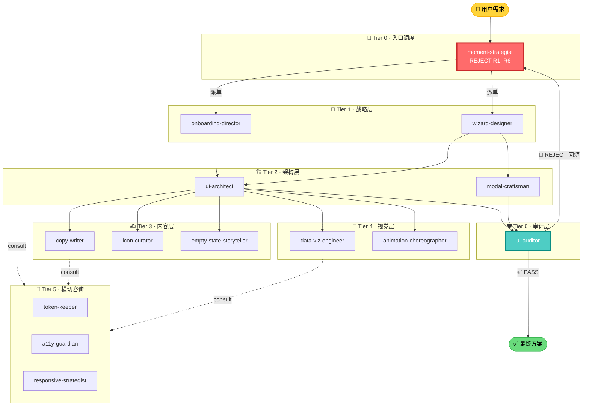

<div align="center">

# 🎭 算鱼设计系统

### *能对老板说「不」的多智能体设计 AI*


**99% 的 AI 永远回答 Yes。这个 AI 有 6 条硬规则可以拒单。**

```
业务方: 「登录页加个 10 秒品牌动画，每天都播。」
🛑 REJECT —— R1 + R2 双重命中：强加体验 + 高频骚扰
   预计 30 天后 DAU 跌 4%。退回业务方。
```

[ 📖 进阶文档 (README.dev) ](README.dev.md) · [ 🎬 SKILL 入口 ](SKILL.md) · [ 🤖 看 14 位 agent ](agents/) · [ 🌐 English ](README.en.md)

</div>

---

## 🏗️ 架构总览



> **REJECT 机制独家**：moment-strategist 内置 R1-R6 6 条硬规则，命中任一即拒，不做就是不做。

---

## 😩 你是不是有这些痛

- **业务方拍脑袋**：「再加个动画」「全屏弹一下」「这里改红色」 —— 没人挡，工程师只能做
- **AI 工具永远顺从**：让它做什么就做什么，没有判断力，没有底线
- **设计语言混乱**：今天的暖色仪式动画，明天就被复用到稳态高频界面，3 个月后用户审美疲劳
- **审计与开发脱节**：design token 一改，审计规则不知道，bug 漏过去

---

## ✨ 核心差异 · 能说 NO 的设计 AI

绝大多数「AI 设计助手」是一个**单 prompt 包打天下**，遇到不合理需求只会硬做。

算鱼设计系统是一家**14 位 agent 的虚拟工作室**，有 6 个 tier，最顶层的 `moment-strategist` 持有 **6 条硬触发的拒单规则**：

| 编号 | 触发条件 |
| --- | --- |
| R1 | 时长 > 5s 且非用户主动触发 |
| R2 | 仪式装饰落在每天 100+ 次的高频界面 |
| R3 | 需求自相矛盾（要快 + 要仪式感） |
| R4 | 违反三条铁律之一 |
| R5 | 想走路径 B 但 4 项硬条件未全满足 |
| R6 | 一屏内要同时跑两个主导 agent |

命中任一条 → **拒单 · 退回业务方 · 给替代方案**。

---

## ⏱ 30 秒小例子

业务方递进来：

> 「给项目列表加一个『删除项目』的二次确认框。」

工作室自动走完：

```
🧭 moment-strategist
   ├─ 快速通道命中: 行 #1 (危险操作弹窗)
   ├─ REJECT 检查: 6 项全过 ✅
   └─ 派单 → 🪟 modal-craftsman

🪟 modal-craftsman 拆树:
   ├─ 主动协作 (Tier 4):
   │   📝 copy-writer    → 「删除「{name}」？此操作无法撤销」
   │   🎯 icon-curator   → TrashIcon outline (颜色找 token-keeper)
   │   📱 responsive-strategist → 移动端 stack 竖排
   └─ 被动咨询 (Tier 5):
       🎨 token-keeper           → red-600 + red-50 ✅ 合规
       💫 animation-choreographer → scaleIn 200ms 功能词汇 ✅
       ♿ a11y-guardian           → role=alertdialog · 初始焦点=取消

🔍 ui-auditor 加载 references/15-audit-ruleset-steady.md v1.0.0
   ├─ 版本同步: ✅
   ├─ 🟥 0 · 🟧 0 · 🟨 1 [ruleset:H-04 已实现]
   └─ ✅ 通过 · 可合并
```

**用时**：3 秒 · 派单 + 4 份 SPEC + 1 份 REPORT，全部有可追溯的规则编号与 owner。

---

## 🥇 三大差异化

### 1. **会拒单** —— 唯一一个会说 NO 的设计 AI
6 项硬触发条件，写死在 `moment-strategist.md`。业务方拍脑袋的需求会被拦下，附带数据化的回退建议。

### 2. **双模式严格隔离** —— 暖嗓子不污染冷嗓子
- 🎬 **仪式模式**：欢迎、版本介绍、庆贺（暖色 / 粒子 / 大动画）
- 🏛 **稳态模式**：日常表格、模态、表单（冷色 / 玻璃 / 微动画）
- **三条铁律**：仪式 keyframes 永不流入稳态界面，反之亦然

### 3. **规则与执行解耦** —— 工程化的版本同步契约
审计规则不藏在 `ui-auditor` 里，而是独立到 `references/15-audit-ruleset-steady.md` 与 `16-audit-ruleset-onboarding.md`。每份规则集都有 `bound_to_token_version` 字段，token 改动必须同步规则集 PR，否则审计员**直接报错拒绝执行**。

---

## 🆚 与其他工具对比

| 维度 | 算鱼设计系统 | shadcn/ui | Tailwind UI | 普通 AI design skill |
| --- | --- | --- | --- | --- |
| **本质** | 多 agent 工作室 | 组件库 | 组件库 + 模板 | 单 prompt |
| **拒单能力** | ✅ 6 项硬规则 | ❌ N/A | ❌ N/A | ❌ 永远 yes |
| **设计决策树** | ✅ 六维体检 + 快速通道 | ❌ 凭工程师感觉 | ❌ 凭设计师感觉 | ⚠️ LLM 自由发挥 |
| **仪式 / 稳态隔离** | ✅ 三条铁律 | ❌ 无概念 | ❌ 无概念 | ❌ 无概念 |
| **审计与规则解耦** | ✅ 版本同步契约 | ❌ N/A | ❌ N/A | ❌ 规则即 prompt |
| **可追溯性** | ✅ 规则编号 + owner | N/A | N/A | ❌ 黑盒 |
| **职责边界** | ✅ 14 agent / 6 tier | N/A | N/A | ❌ 大锅炖 |
| **适合谁** | 内部产品 / 需要 design ops 的团队 | 独立开发者 | 商业 SaaS | 个人项目 |
| **学习成本** | 中等（有快速通道兜底） | 低 | 低 | 极低 |
| **代表理念** | "Say NO when you should" | "Build your own" | "Pay for done" | "Just ship" |

---

## 🚀 快速安装

```bash
# 1. 克隆到项目
git clone https://github.com/<owner>/suanfish-design-system .github/skills/suanfish-design-system

# 2. （可选）全局链接给 GitHub Copilot CLI / Claude Code / Codex 使用
ln -sf "$(pwd)/.github/skills/suanfish-design-system" ~/.copilot/skills/suanfish-design-system

# 3. 在 CLI 里触发
# 任意涉及 UI / 设计 / 动画 / 文案 / a11y / 模态 / 向导 / 图表的请求都会自动启用
```

---

## 🏛 14 位 agent · 6 个 tier

```
┌────────────────────────────────────────────────────────┐
│ Tier 1 · 调度       🧭 moment-strategist (可 REJECT)    │
├────────────────────────────────────────────────────────┤
│ Tier 2 · 主导       🎬 onboarding · 🏛 ui-architect     │
├────────────────────────────────────────────────────────┤
│ Tier 3 · 容器专科   🪟 modal · 🧙 wizard · 📊 viz        │
├────────────────────────────────────────────────────────┤
│ Tier 4 · 内容专科   📝 copy · 🎯 icon                   │
│                    🪟 empty-state · 📱 responsive       │
├────────────────────────────────────────────────────────┤
│ Tier 5 · 横切咨询   🎨 token · 💫 anim · ♿ a11y        │
├────────────────────────────────────────────────────────┤
│ Tier 6 · 质量门     🔍 ui-auditor (加载 ref 15 / 16)    │
└────────────────────────────────────────────────────────┘
```

每位 agent 都是一个独立的 `.md` 文件，有 frontmatter 声明 `reports_to` / `consults` / `audited_by` / `references`，可以独立审阅、独立修改。

详见 [`agents/`](agents/) 目录。

---

## 📂 项目结构

```
suanfish-design-system/
├── SKILL.md                 # 总指挥 + 6 维决策树 + 5 套快速通道
├── README.md                # 你正在读的文件
├── README.dev.md            # 给已经懂的人 · 技术细节
├── CHANGELOG.md             # 版本历史
├── .skill-manifest.json     # 机读元数据
├── LICENSE                  # MIT
├── agents/                  # 14 位匠人
│   ├── moment-strategist.md
│   ├── onboarding-director.md
│   ├── ui-architect.md
│   └── ... (11 more)
└── references/              # 21 份规范
    ├── 00-collaboration-protocol.md
    ├── 01-design-tokens.md
    ├── 02-onboarding-eureka.md
    ├── ... (12 more)
    ├── 15-audit-ruleset-steady.md       # ⭐ v2.1 独立规则集
    └── 16-audit-ruleset-onboarding.md   # ⭐ v2.1 独立规则集
```

---

## ⚠️ 不适合谁用（反向筛选）

- ❌ **只想做一个 landing page 的人** —— 杀鸡用牛刀，去用 Tailwind UI
- ❌ **不喜欢「被 AI 反驳」的团队** —— REJECT 机制对你是负担不是资产
- ❌ **追求 5 分钟出 demo 的人** —— 学习架构要半小时
- ❌ **没有 design system 沉淀需求的个人项目** —— 6 tier 是企业级配置

**适合谁**：
- ✅ 有真实产品要长期维护的 in-house 团队
- ✅ 厌倦了「业务方什么都要做」的设计 / 工程 lead
- ✅ 想把 design ops 工程化的技术管理者
- ✅ 喜欢可追溯、可审计、可问责的工程师

---

## 📜 许可

[MIT](LICENSE) · 算鱼工作室

---

<div align="center">

**如果你也被「永远说 yes 的 AI」毒打过，给个 ⭐ Star。**

</div>
