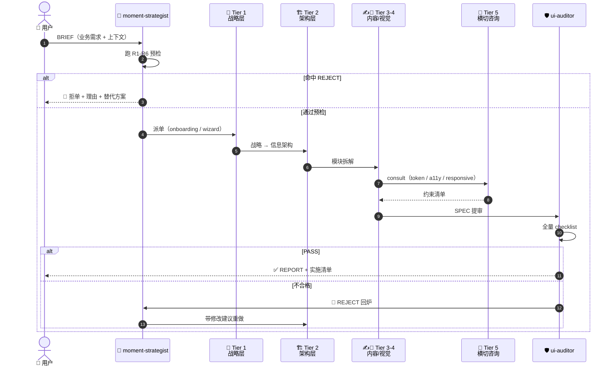
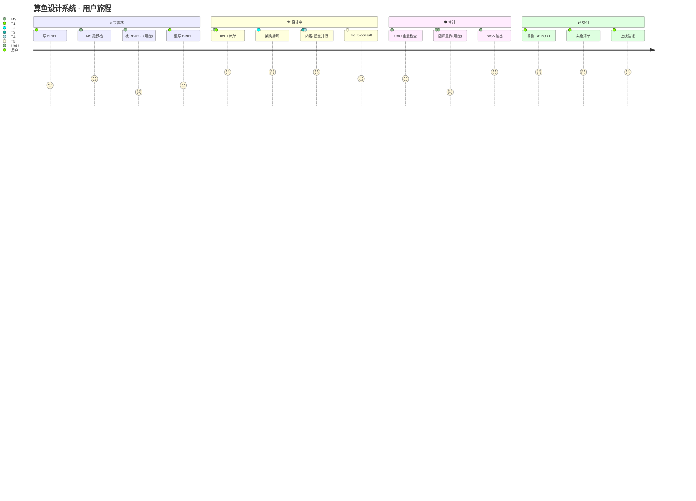
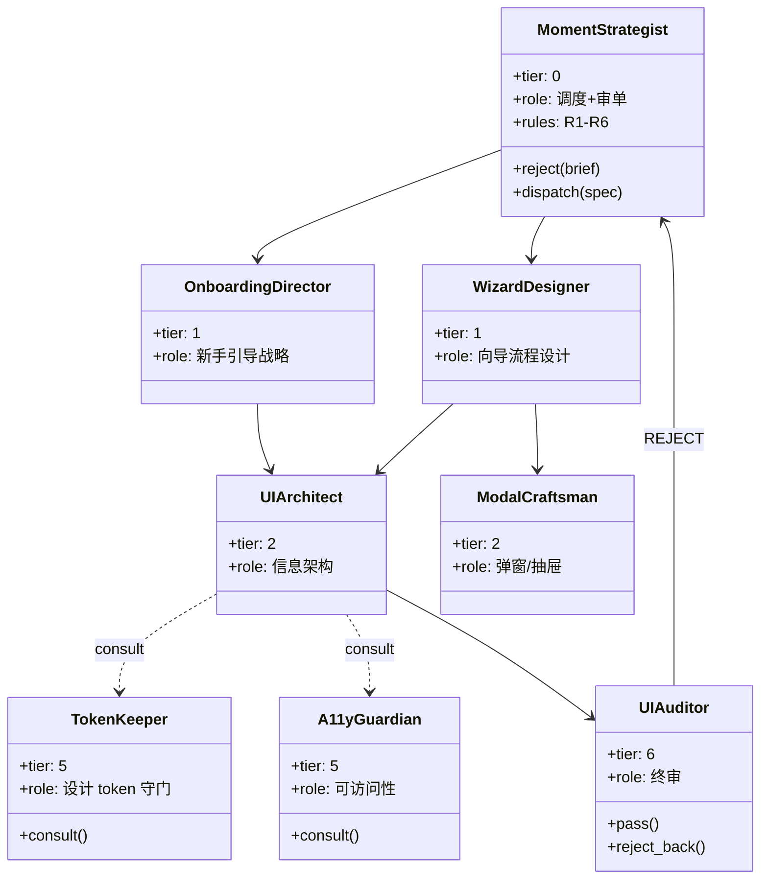

<div align="center">

# 🎭 算鱼设计系统

### *能对老板说「不」的多智能体设计 AI*


**99% 的 AI 永远回答 Yes。这个 AI 现在有 25 条硬规则 + 一个圣人议会 — v4.0 砸了"八圣人固定每次全上"的地基, 改为议会民主: 因事召唤 k 位 Tier 0, 自由邀请师弟师妹 (cap 15), 陪审团 2/3 加权表决。R24 议会僵局律 + R25 引用真实律兜底。**

```
业务方: 「登录页加个 10 秒品牌动画，每天都播。」
🛑 REJECT —— R1 + R2 双重命中：强加体验 + 高频骚扰
   预计 30 天后 DAU 跌 4%。退回业务方。

业务方: 「既要 100% AI 自动，又要用户随时介入每个细节。」
🛑 REJECT —— R18 命中：矛盾两端都站（D2 没选倾向）
   请补全 BRIEF 后重新提交。  ← v3.0 新规
```

[ 📖 进阶文档 (README.dev) ](README.dev.md) · [ 🎬 SKILL 入口 ](SKILL.md) · [ 🤖 看 36 位 agent ](agents/) · [ 🌗 三层哲学 ](references/24-philosophy-dialectics.md) · [ 🌐 English ](README.en.md)

</div>

---

## 🌗 v3.0 三层哲学体系（What's New）

| Layer | 文件 | 回答的问题 | 触发 R 规则 |
| --- | --- | --- | :---: |
| **Layer 1 · 价值** | [17-philosophy.md](references/17-philosophy.md) | 该选哪边？ | R1-R12 |
| **Layer 2 · 辩证** ✨ | [24-philosophy-dialectics.md](references/24-philosophy-dialectics.md) | 为什么有两边？ | R18 |
| **Layer 3 · 发展规律** ✨ | [25-philosophy-laws.md](references/25-philosophy-laws.md) | 矛盾如何随时间漂移？ | R13-R17 |
| **Layer 0.5 · 历史定位** ✨ | [26-historical-positioning.md](references/26-historical-positioning.md) | 我来自哪个时代？要去哪个时代？ | — |

任何 BRIEF 入场顺序：**🪙 dialectician → 📜 historian → 🔭 futurist → 🧭 moment-strategist → A-G 路径**

---

## 📚 v3.0.1 新增 · 301 位哲学家板凳（全球唯一中国哲学驱动）

> 我们把 301 位中外思想家系统归档到 `references/27-philosopher-bench.md` —— **117 位中国 + 184 位西方 / 全球**。
> 每位都带"一句话核心 + 装进设计系统的钩子"。
> v3.x 任何新 agent / 新 R 规则,必须援引板凳里至少 1 位作为哲学锚点。

```
✅ 已开采 4 位:  #039 黑格尔 / #058 福柯 / #091 怀特海 / #086 维纳
🔥 v3.1 强推:   #092 老子 / #093 庄子 / #232 王弼 / #249 法藏 / #225 王充
🌐 学派覆盖:    古希腊→分析→后结构→中国先秦→宋明心学→当代新儒家
```

📖 **[查看 301 人完整板凳 →](references/27-philosopher-bench.md)**

---

## 🏗️ 架构总览 · v3.0 (36 agent · 8 tier · 7 path · Tier 0 辩证哲学层 + Path G AI-native)

```mermaid
flowchart LR
    User([👤 用户<br/>BRIEF])

    subgraph T0 ["🚦 Tier 1 · 入口调度"]
        MS["moment-strategist<br/><i>REJECT R1–R6</i>"]
    end

    subgraph T05 ["🚦 Tier 1.5 · 协调 (v2.4)"]
        FC[flow-coordinator]
    end

    subgraph T2 ["🎯 Tier 2 · 4 路径主理"]
        OD["onboarding-director<br/>Path A 仪式"]
        UA["ui-architect<br/>Path B/E/F 稳态"]
        CD["conversation-director<br/>Path C 聊天 ✨"]
        ND["notification-director<br/>Path D 通知 ✨"]
    end

    subgraph T3 ["🏗️ Tier 3 · 5 容器专科"]
        MC[modal-craftsman]
        WD[wizard-designer]
        DV[data-viz-engineer]
        TC["table-craftsman ✨"]
        CC["chat-ui-craftsman ✨"]
    end

    subgraph T4 ["✍️🎨 Tier 4 · 7 内容专科"]
        CW[copy-writer]
        IC[icon-curator]
        ES[empty-state-storyteller]
        RS[responsive-strategist]
        PA["persona-architect ✨"]
        IA["information-architect ✨"]
        ER["error-recovery-designer ✨"]
    end

    subgraph T5 ["🧩 Tier 5 · 5 横切咨询"]
        TK[token-keeper]
        AC[animation-choreographer]
        AG[a11y-guardian]
        BK["brand-keeper ✨"]
        I18["i18n-strategist ✨"]
    end

    subgraph T6 ["🛡️ Tier 6 · 审计"]
        UAU["ui-auditor<br/>ref 15+16+19"]
    end

    Output([✅ REPORT<br/>实施清单])

    User ==> MS
    MS ==>|单路径| T2
    MS ==>|多路径| FC
    FC ==> T2
    T2 ==> T3
    T3 ==> T4
    T4 ==> UAU
    T3 -.consult.-> T5
    T4 -.consult.-> T5
    UAU ==>|✅ PASS| Output
    UAU -.->|🛑 REJECT 回炉| MS

    classDef tier0 fill:#FCA5A5,stroke:#DC2626,color:#7F1D1D,stroke-width:2px
    classDef tier05 fill:#FECACA,stroke:#B91C1C,color:#7F1D1D,stroke-width:1.5px
    classDef tier2 fill:#DDD6FE,stroke:#7C3AED,color:#4C1D95,stroke-width:1.5px
    classDef tier3 fill:#BFDBFE,stroke:#2563EB,color:#1E3A8A,stroke-width:1.5px
    classDef tier4 fill:#A7F3D0,stroke:#059669,color:#064E3B,stroke-width:1.5px
    classDef tier5 fill:#FEF08A,stroke:#CA8A04,color:#713F12,stroke-width:1.5px
    classDef tier6 fill:#FDBA74,stroke:#EA580C,color:#7C2D12,stroke-width:1.5px
    classDef entry fill:#F3F4F6,stroke:#6B7280,color:#111827,stroke-width:2px
    classDef exit fill:#6EE7B7,stroke:#047857,color:#064E3B,stroke-width:2px

    class MS tier0
    class FC tier05
    class OD,UA,CD,ND tier2
    class MC,WD,DV,TC,CC tier3
    class CW,IC,ES,RS,PA,IA,ER tier4
    class TK,AC,AG,BK,I18 tier5
    class UAU tier6
    class User entry
    class Output exit
```



> **✨ = v2.4 新增 agent**（10 个）。多路径混合时由 `flow-coordinator` (Tier 1.5) 协调。

> **REJECT 机制独家**：moment-strategist 内置 R1-R6 6 条硬规则，命中任一即拒，不做就是不做。每条 REJECT 都绑定一条不可让步的哲学命题（详见 [📜 哲学根基](references/17-philosophy.md)）。

<details>
<summary>📐 <b>架构图变体 · 点开看更多视角</b>（数据流 / 决策树 / 用户旅程）</summary>

### 🔄 变体 1 · 数据流时序图（BRIEF → SPEC → REPORT）



### 🛑 变体 2 · REJECT R1-R6 决策树


### 🗺️ 变体 3 · 用户旅程图（从需求到交付）



### 📦 变体 4 · 6 Tier 类图（看清职责边界）



</details>

---

## 😩 你是不是有这些痛

- **业务方拍脑袋**：「再加个动画」「全屏弹一下」「这里改红色」 —— 没人挡，工程师只能做
- **AI 工具永远顺从**：让它做什么就做什么，没有判断力，没有底线
- **设计语言混乱**：今天的暖色仪式动画，明天就被复用到稳态高频界面，3 个月后用户审美疲劳
- **审计与开发脱节**：design token 一改，审计规则不知道，bug 漏过去

---

## ✨ 核心差异 · 能说 NO 的设计 AI

绝大多数「AI 设计助手」是一个**单 prompt 包打天下**，遇到不合理需求只会硬做。

算鱼设计系统是一家**33 位 agent 的虚拟工作室**，分布在 7 个 tier、7 条设计路径上（含 v2.5 新增 AI-native 路径 G），最顶层的 `moment-strategist` 持有 **6 条硬触发的拒单规则**：

| 编号 | 触发条件 |
| --- | --- |
| R1 | 时长 > 5s 且非用户主动触发 |
| R2 | 仪式装饰落在每天 100+ 次的高频界面 |
| R3 | 需求自相矛盾（要快 + 要仪式感） |
| R4 | 违反三条铁律之一 |
| R5 | 想走路径 B 但 4 项硬条件未全满足 |
| R6 | 一屏内要同时跑两个主导 agent |

命中任一条 → **拒单 · 退回业务方 · 给替代方案**。

---

## ⏱ 30 秒小例子

业务方递进来：

> 「给项目列表加一个『删除项目』的二次确认框。」

工作室自动走完：

```
🧭 moment-strategist
   ├─ 快速通道命中: 行 #1 (危险操作弹窗)
   ├─ REJECT 检查: 6 项全过 ✅
   └─ 派单 → 🪟 modal-craftsman

🪟 modal-craftsman 拆树:
   ├─ 主动协作 (Tier 4):
   │   📝 copy-writer    → 「删除「{name}」？此操作无法撤销」
   │   🎯 icon-curator   → TrashIcon outline (颜色找 token-keeper)
   │   📱 responsive-strategist → 移动端 stack 竖排
   └─ 被动咨询 (Tier 5):
       🎨 token-keeper           → red-600 + red-50 ✅ 合规
       💫 animation-choreographer → scaleIn 200ms 功能词汇 ✅
       ♿ a11y-guardian           → role=alertdialog · 初始焦点=取消

🔍 ui-auditor 加载 references/15-audit-ruleset-steady.md v1.0.0
   ├─ 版本同步: ✅
   ├─ 🟥 0 · 🟧 0 · 🟨 1 [ruleset:H-04 已实现]
   └─ ✅ 通过 · 可合并
```

**用时**：3 秒 · 派单 + 4 份 SPEC + 1 份 REPORT，全部有可追溯的规则编号与 owner。

---

## 🥇 三大差异化

### 1. **会拒单** —— 唯一一个会说 NO 的设计 AI
6 项硬触发条件，写死在 `moment-strategist.md`。业务方拍脑袋的需求会被拦下，附带数据化的回退建议。

### 2. **双模式严格隔离** —— 暖嗓子不污染冷嗓子
- 🎬 **仪式模式**：欢迎、版本介绍、庆贺（暖色 / 粒子 / 大动画）
- 🏛 **稳态模式**：日常表格、模态、表单（冷色 / 玻璃 / 微动画）
- **三条铁律**：仪式 keyframes 永不流入稳态界面，反之亦然

### 3. **规则与执行解耦** —— 工程化的版本同步契约
审计规则不藏在 `ui-auditor` 里，而是独立到 `references/15-audit-ruleset-steady.md` 与 `16-audit-ruleset-onboarding.md`。每份规则集都有 `bound_to_token_version` 字段，token 改动必须同步规则集 PR，否则审计员**直接报错拒绝执行**。

### 4. **哲学根基（v2.2）** —— 每位 agent 都有不可让步的命题
33 位 agent 各配一条哲学锚点（孙子 · 上兵伐谋 / 老子 · 大象无形 / 康德 · 绝对命令 / 赫拉克利特 · 万物皆流 / 福柯 · 知识即权力 ……），REJECT R1-R6 配哲学命题，外加 20 条经典法典（Dieter Rams / Tufte / 包豪斯）和 30+ 条案例。v2.5 AI-native 路径 G 又叠加了 27 条 P-XX 哲学规则（可视化 / 归因化 / 透明化 / 可撤回）。当业务方拍脑袋时，agent 不是机械引用规则——而是引用**信念**。详见 [📜 references/17-philosophy.md](references/17-philosophy.md)。

---

## 🆚 与其他工具对比

| 维度 | 算鱼设计系统 | shadcn/ui | Tailwind UI | 普通 AI design skill |
| --- | --- | --- | --- | --- |
| **本质** | 多 agent 工作室 | 组件库 | 组件库 + 模板 | 单 prompt |
| **拒单能力** | ✅ 6 项硬规则 | ❌ N/A | ❌ N/A | ❌ 永远 yes |
| **设计决策树** | ✅ 六维体检 + 快速通道 | ❌ 凭工程师感觉 | ❌ 凭设计师感觉 | ⚠️ LLM 自由发挥 |
| **仪式 / 稳态隔离** | ✅ 三条铁律 | ❌ 无概念 | ❌ 无概念 | ❌ 无概念 |
| **审计与规则解耦** | ✅ 版本同步契约 | ❌ N/A | ❌ N/A | ❌ 规则即 prompt |
| **可追溯性** | ✅ 规则编号 + owner | N/A | N/A | ❌ 黑盒 |
| **职责边界** | ✅ 33 agent / 7 tier / 7 path | N/A | N/A | ❌ 大锅炖 |
| **适合谁** | 内部产品 / 需要 design ops 的团队 | 独立开发者 | 商业 SaaS | 个人项目 |
| **学习成本** | 中等（有快速通道兜底） | 低 | 低 | 极低 |
| **代表理念** | "Say NO when you should" | "Build your own" | "Pay for done" | "Just ship" |

---

## 🚀 快速安装

```bash
# 1. 克隆到项目
git clone https://github.com/<owner>/suanfish-design-system .github/skills/suanfish-design-system

# 2. （可选）全局链接给 GitHub Copilot CLI / Claude Code / Codex 使用
ln -sf "$(pwd)/.github/skills/suanfish-design-system" ~/.copilot/skills/suanfish-design-system

# 3. 在 CLI 里触发
# 任意涉及 UI / 设计 / 动画 / 文案 / a11y / 模态 / 向导 / 图表的请求都会自动启用
```

---

## 🏛 33 位 agent · 7 个 tier · 7 条路径

```
┌─────────────────────────────────────────────────────────────────┐
│ Tier 1   · 调度          🧭 moment-strategist (可 REJECT)        │
├─────────────────────────────────────────────────────────────────┤
│ Tier 1.5 · 协调          🔀 flow-coordinator (跨路径桥)          │
├─────────────────────────────────────────────────────────────────┤
│ Tier 2   · 主导 ×4       🎬 onboarding · 🏛 ui-architect          │
│                          💬 conversation · 🔔 notification        │
├─────────────────────────────────────────────────────────────────┤
│ Tier 3   · 容器专科 ×10  🪟 modal · 🧙 wizard · 📊 viz · 📋 table │
│                          💬 chat-ui · 🌊 stream · 🛠️ tool-call    │
│                          🧵 thread · 🎨 artifact · ✍️ prompt-input│
├─────────────────────────────────────────────────────────────────┤
│ Tier 4   · 内容专科 ×10  📝 copy · 🎯 icon · 🪟 empty-state       │
│                          📱 responsive · 👤 persona · 🗂 info-arch│
│                          🔧 error-recovery · 🧠 reasoning-viz     │
│                          📑 citation · ⏱️ rate-limit              │
├─────────────────────────────────────────────────────────────────┤
│ Tier 5   · 横切咨询 ×6   🎨 token · 💫 anim · ♿ a11y · 🏷 brand  │
│                          🌐 i18n · 🔀 model-switcher              │
├─────────────────────────────────────────────────────────────────┤
│ Tier 6   · 质量门        🔍 ui-auditor (加载 ref 15/16, 33 行覆盖)│
└─────────────────────────────────────────────────────────────────┘

7 条路径：A 仪式 · B 稳态 · C 聊天 · D 通知 · E 移动 · F 嵌入 · G AI-native（叠加层）
```

每位 agent 都是一个独立的 `.md` 文件，有 frontmatter 声明 `reports_to` / `consults` / `audited_by` / `references`，可以独立审阅、独立修改。

详见 [`agents/`](agents/) 目录。

---

## 📂 项目结构

```
suanfish-design-system/
├── SKILL.md                 # 总指挥 + 6 维决策树 + 5 套快速通道
├── README.md                # 你正在读的文件
├── README.dev.md            # 给已经懂的人 · 技术细节
├── CHANGELOG.md             # 版本历史
├── .skill-manifest.json     # 机读元数据
├── LICENSE                  # MIT
├── agents/                  # 33 位匠人（v2.5 新增 9 位 AI-native 锚点）
│   ├── moment-strategist.md
│   ├── onboarding-director.md
│   ├── ui-architect.md
│   ├── conversation-director.md
│   └── ... (29 more · 含 stream/tool-call/thread/reasoning/citation/artifact/...)
└── references/              # 23 份规范（v2.5 哲学补丁覆盖路径 G）
    ├── 00-collaboration-protocol.md
    ├── 01-design-tokens.md
    ├── 02-onboarding-eureka.md
    ├── ... (12 more)
    ├── 15-audit-ruleset-steady.md       # ⭐ v2.1 独立规则集
    └── 16-audit-ruleset-onboarding.md   # ⭐ v2.1 独立规则集
```

---

## ⚠️ 不适合谁用（反向筛选）

- ❌ **只想做一个 landing page 的人** —— 杀鸡用牛刀，去用 Tailwind UI
- ❌ **不喜欢「被 AI 反驳」的团队** —— REJECT 机制对你是负担不是资产
- ❌ **追求 5 分钟出 demo 的人** —— 学习架构要半小时
- ❌ **没有 design system 沉淀需求的个人项目** —— 6 tier 是企业级配置

**适合谁**：
- ✅ 有真实产品要长期维护的 in-house 团队
- ✅ 厌倦了「业务方什么都要做」的设计 / 工程 lead
- ✅ 想把 design ops 工程化的技术管理者
- ✅ 喜欢可追溯、可审计、可问责的工程师

---

## 📜 许可

[MIT](LICENSE) · 算鱼工作室

---

<div align="center">

**如果你也被「永远说 yes 的 AI」毒打过，给个 ⭐ Star。**

</div>
