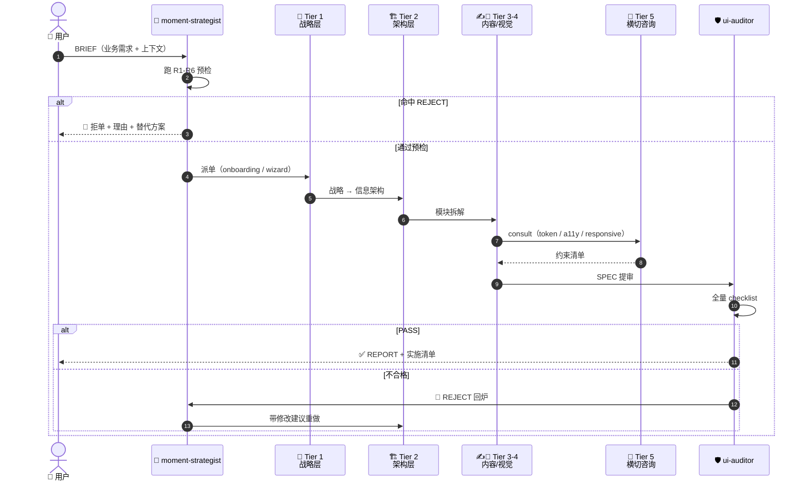
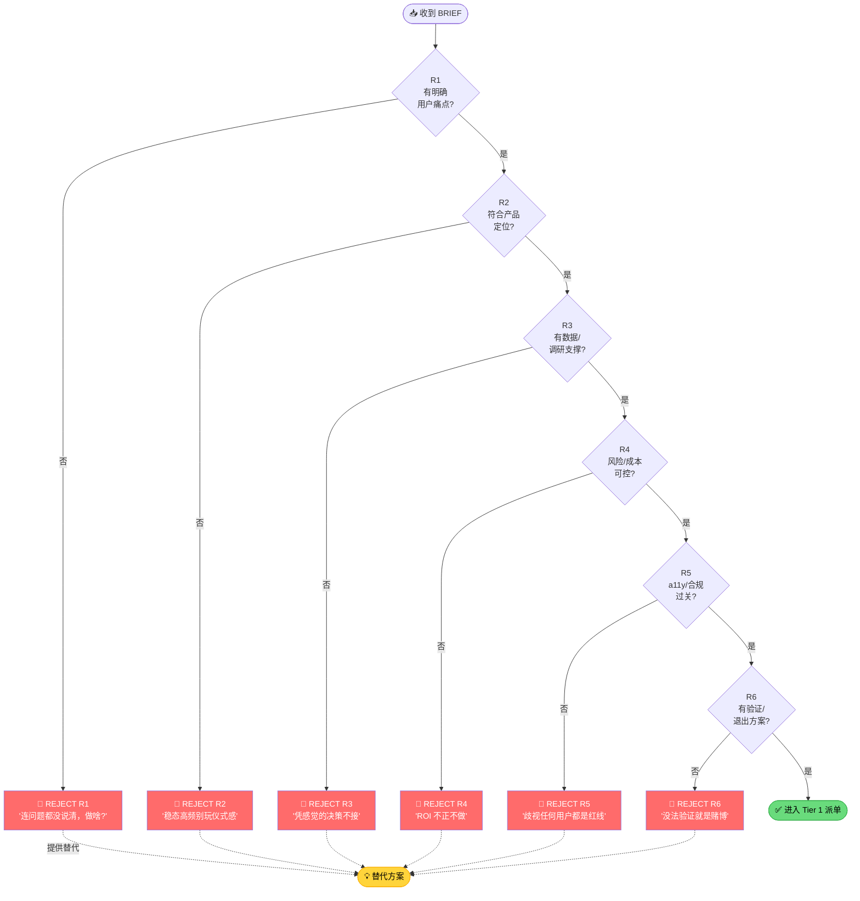
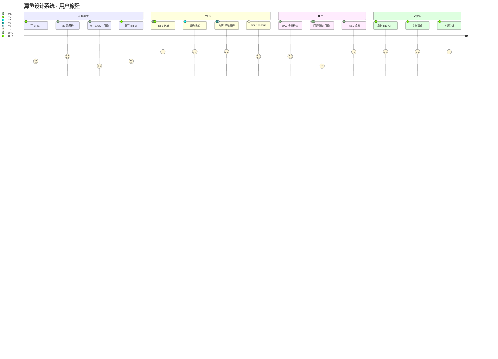
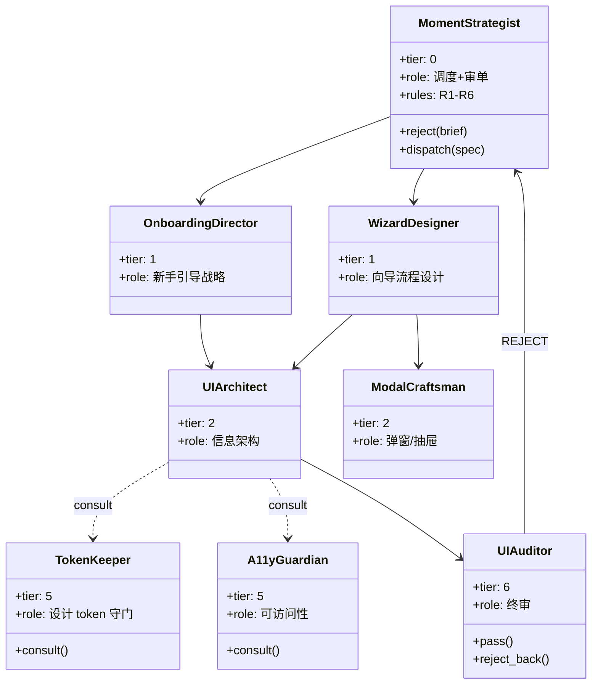
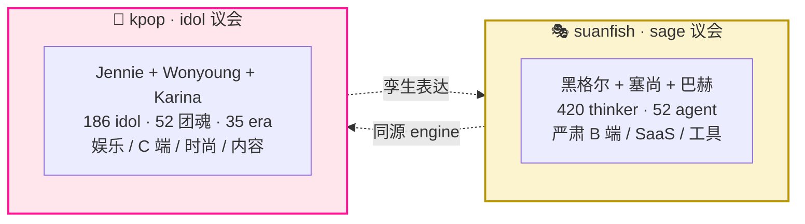

<div align="center">

# 🎭 算鱼设计系统

### *能对老板说「不」的多智能体设计 AI*


**99% 的 AI 永远说"好的"。这个 AI 会先反问你: 这事真该做吗?**

它内置 25 条硬规则——比如老板要"每次进首页都弹 10 秒品牌动画"? 直接拒绝, 还给你算 30 天后 DAU 会跌 4%。

**v4.2 升级** (P0/P1/P2 蓝军批判全治): 圣人议会从 v4.1 的"8 哲+2 艺+2 音"重平衡为 v4.2 严格"**4:4:4 均权三大类**" — 议会内置 [减法派 ⟷ 加法派] 民主辩证, 单一圣人禁一票否决, task_kind 改 user-declared 优先 (防 LLM 自利路由), 艺术家/音乐家新增 R-Cross1-4 规则锚。简单事 2 个圣人就够 (省 80% token), 复杂事多类辩论 + 2/3 投票通过才出方案。

```
业务方: 「登录页加个 10 秒品牌动画，每天都播。」
🛑 REJECT —— R1 + R2 双重命中：强加体验 + 高频骚扰
   预计 30 天后 DAU 跌 4%。退回业务方。

业务方: 「既要 100% AI 自动，又要用户随时介入每个细节。」
🛑 REJECT —— R18 命中：矛盾两端都站（D2 没选倾向）
   请补全 BRIEF 后重新提交。  ← v3.0 新规
```

[ 📖 进阶文档 (README.dev) ](README.dev.md) · [ 🎬 SKILL 入口 ](SKILL.md) · [ 🏛 议会 demo (5 TC) ](docs/v4.2-congress-simulation.md) · [ 🤖 看 52 位 agent ](agents/) · [ 🌗 三层哲学 ](references/24-philosophy-dialectics.md) · [ 🌐 English ](README.en.md)

</div>

---

## ⚡ 一键安装 · One-line Install

> 自动检测你装了 `.copilot` / `.claude` / `.agents` / `.codex` / `.gemini` / `.antigravity` 哪些 CLI/IDE, 自动 symlink, 自动支持后续 `update` / `uninstall`。

### 🚀 方式 0 · 一行命令 (推荐 · 跨平台)

```bash
# 任何装了 Node 的平台 (Mac / Linux / Windows / WSL)
npx -y github:SuanFishXYY/suanfish-design-system
```

```bash
# Mac / Linux (不装 Node 也行)
curl -sSL https://raw.githubusercontent.com/SuanFishXYY/suanfish-design-system/main/installer/install.sh | bash
```

```powershell
# Windows PowerShell (不装 Node 也行)
iwr -useb https://raw.githubusercontent.com/SuanFishXYY/suanfish-design-system/main/installer/install.ps1 | iex
```

后续运维:

```bash
npx -y github:SuanFishXYY/suanfish-design-system update      # 拉最新版
npx -y github:SuanFishXYY/suanfish-design-system uninstall   # 移除所有 symlink
```

### 方式 A · Claude Code 插件市场

```bash
# 在 Claude Code 里执行
/plugin marketplace add SuanFishXYY/suanfish-marketplace
/plugin install suanfish-design-system
```

### 方式 B · 手动 git clone + symlink (掌控派)

<details>
<summary>展开看手动步骤</summary>

```bash
git clone https://github.com/SuanFishXYY/suanfish-design-system.git ~/.suanfish-design-system
ln -sf ~/.suanfish-design-system ~/.copilot/skills/suanfish-design-system     # GitHub Copilot CLI
ln -sf ~/.suanfish-design-system ~/.claude/skills/suanfish-design-system      # Claude Code
ln -sf ~/.suanfish-design-system ~/.agents/skills/suanfish-design-system      # 通用
ln -sf ~/.suanfish-design-system ~/.antigravity/skills/suanfish-design-system # Antigravity (Google)
ls ~/.copilot/skills/suanfish-design-system/agents/ | wc -l   # 应该 52
```

Windows PowerShell 用 `New-Item -ItemType Junction` 替代 `ln -sf`。

</details>

### 怎么用 · How to trigger

**直接对你的 AI 说话, 涉及以下关键词时自动启用**:

> UI / 设计 / 组件 / 动画 / 文案 / a11y / 弹窗 / 引导 / 图表 / 对话 / 通知 / 移动端 / AI 助手界面

**示例 BRIEF**:

```
你: "帮我设计一个企业 dashboard 的毛玻璃数据卡片"

算鱼: 🏛 议会召唤中...
      ① 评分: silence-architect (8.5) / holism-strategist (7.85) / wuwei-master (7.65) 入场
      ② 邀请: 西田 / 海德格尔 / 怀特海 / 维纳 / 庄子 (5 助手)
      ③ 讨论: blur 半径三态辩证 + 200ms 反馈环 + 暗黑模式自动反转
      ④ 投票: 7/10 = 70% ≥ 67% ✓ 第 1 轮通过
      → 5 条具体设计决策 + 引用核验 + 路径推荐 Path B
```

完整 5 TC 演示见 → [docs/v4.2-congress-simulation.md](docs/v4.2-congress-simulation.md)

### REJECT 示例 · 你会看到的样子

```
你: "登录页加个 10 秒品牌动画, 每天都播"
算鱼: 🛑 REJECT —— R1 + R2 双重命中: 强加体验 + 高频骚扰
      预计 30 天后 DAU 跌 4%。退回业务方。
```

---

## 🏛 核心机制 · v4.2 三大类圣人议会民主 (4:4:4 均权)

**这是算鱼和其他设计 AI 最根本的区别**——不是"AI 给你答案", 而是"AI 帮你召开一场跨三大类专家会议 + 议会内辩证 + 陪审团表决给你答案"。

### 🌟 v4.2 Tier 0 三大类 · 12 位圣人 (4:4:4 严格均权)

| 类 | 数 | 圣人 (锚 #ID · [+]加法 [-]减法 [~]中间) |
| --- | --- | --- |
| 🏛 **哲学家** | 4 | 黑格尔#039 (辩证) · 王弼#232 (留白[-]) · 法藏#249 (整体) · 王充#225 (引用核验) |
| 🎨 **艺术家** | 4 | **达芬奇#A001** ⭐ (`polymath-bridger` 跨学科[+]) · 米开朗基罗#A002 (`form-liberator` 减法[-]) · **莫奈#A019** (`light-impressionist` 光色[+]) · 倪瓒#A045 (`void-painter` 留白[-]) |
| 🎵 **音乐家** | 4 | 巴赫#M001 (`counterpoint-architect` 对位[~]) · **贝多芬#M005** ⭐ (`tension-composer` 张力[+]) · 凯奇#M020 (`silence-composer` 沉默[-]) · **Brian Eno#M025** (`ambient-architect` 陪伴[~]) |

> ⭐ = v4.2 新晋 (用户点名)。**议会内置辩证机制**:
> - 留白宗师三角 [-] (王弼/倪瓒/凯奇) ⟷ 加法平衡三角 [+] (达芬奇/莫奈/贝多芬)
> - 音乐三档位灰度: 凯奇(沉默) ↔ Eno(陪伴) ↔ 贝多芬(高潮)
> - 任一派别 (减法 5 / 加法 4 / 中间态 3) 都不足 6 票, 无法单方决议 (P1-6 修)

**曾降级四人 (v4.2.6 已并入普通板凳)**: 福柯 / 怀特海 / 老子 / 庄子 — agent 文件保留作人格锚点, v4.2.6 起与全员同台竞选常委, 不再有"不自动入场"的特殊身份。

```
                          你的 BRIEF
                              ↓
        ┌─────────────────────────────────────────────┐
        │   🏛 议会六步协议 (bench-matcher 全包)        │
        ├─────────────────────────────────────────────┤
        │  ① 路由   task_kind 由用户声明优先 (v4.2 P1-5)│
        │           visual→艺术家 +0.5 · motion→音乐家  │
        │  ② 评分   12 位 Tier 0 按需求 5 维打分        │
        │  ③ 召唤   ≥7.5 分入场 (典型 2-5 位 · 三大类各≥1)│
        │  ④ 邀请   跨三大类师承网络 (cap 15)            │
        │  ⑤ 讨论   全员陈述 → 加减辩证 → 共识            │
        │  ⑥ 投票   Tier 0=2 票 + 类别匹配 +0.5 (cap 2.5)│
        │           ≥ 2/3 通过 · 禁一票否决 (P1-6)      │
        └─────────────────────────────────────────────┘
                              ↓
        🔍 引用核验 (R25 + R-Cross1-4 五律兜底)
                              ↓
                 🧭 派单 → Path A-G → 🛡 体检
```

### 议会的五个关键设计 (v4.2 P0/P1/P2 修订)

| 设计 | 解决什么问题 | v4.1 时代的做法 |
| --- | --- | --- |
| **4:4:4 均权** | 三大类话语权平等 (P0-1) | v4.1 8:2:2 哲学家压倒 |
| **加减辩证** | 减法派与加法派议会内辩 (P0-2) | v4.1 4 位新晋全是减法派 |
| **用户点名 Tier 0** | 达芬奇 + 贝多芬入场 (P0-3) | v4.1 用户点名了但只给 1 个席位 |
| **任务路由 user-declared** | task_kind 由 BRIEF 显式声明 (P1-5) | v4.1 LLM 自利推断, 可被 hack |
| **禁一票否决** | silence-composer 等"反对派"必须走议会民主 (P1-6) | v4.1 silence-composer 默认 reject |
| **R-Cross1-4** | 艺音 Tier 0 也有 R 规则锚 (P2-8) | v4.1 仅哲学家有 R 规则 |

### 议会调用成本

| BRIEF 类型 | task_kind | 入场人数 | LLM 调用 | 对比 v3.x |
| --- | --- | --- | --- | --- |
| 简单调整 (圆角/颜色) | structural | 1 圣人 | ~5 calls | **省 80%** |
| 品牌 hero 配色 | visual | 3-5 人 (艺为主) | ~12 calls | 省 50% |
| loading 动效节奏 | motion | 3-5 人 (音为主) | ~12 calls | 省 50% |
| 中等组件 (毛玻璃卡片) | structural | 6-8 人 | ~18 calls | 省 30% |
| 全链路改版 (品牌系统) | mixed | 10-15 人 (三大类合议) | ~40 calls | 持平 |
| 哲学冲突 (要 2 轮投票) | philosophical | 9 人 | ~25 calls | 持平 |

📖 完整 5 TC 演示 → [docs/v4.2-congress-simulation.md](docs/v4.2-congress-simulation.md)

---

## 🌗 三层哲学 + 420 思想家 (议会的"知识库")

**议会能开起来, 是因为底下有 420 位真实思想家做后盾** —— 不是 LLM 瞎编圣人, 每条引用都能在板凳里查到。

| Part | 数 | 内容 | 用途 |
| --- | --- | --- | --- |
| **Part I 哲学家** | 335 | 古希腊 → 当代设计/媒介/中文 (含 Don Norman / Christopher Alexander / Byung-Chul Han / 蒋勋 / 王澍 / 陈嘉映) | 价值取向 · 矛盾辩证 · 系统结构 |
| **Part II 艺术家** | 50 | 文艺复兴 → 当代 + 中国书画 (含 达芬奇 / 米开朗基罗 / 倪瓒 / 陈丹青 / 木心) | 配色 / 构图 / 视觉文化锚点 |
| **Part III 音乐家** | 35 | 巴洛克 → ambient + 中国民乐 (含 巴赫 / 海顿 / 贝多芬 / 凯奇 / Brian Eno / 坂本龙一) | 节奏 / 结构 / 配乐 / 氛围 |

| Layer | 回答什么 | R 规则 |
| --- | --- | --- |
| **价值** [📖](references/17-philosophy.md) | 该选哪边? | R1-R12 |
| **辩证** [📖](references/24-philosophy-dialectics.md) | 为什么有两边? | R18 |
| **发展规律** [📖](references/25-philosophy-laws.md) | 矛盾如何随时间漂移? | R13-R17 |
| **历史定位** [📖](references/26-historical-positioning.md) | 这个时代该怎么做? | — |

📚 **[420 位思想家板凳 →](references/27-philosopher-bench.md)** (335 哲学家 + 50 艺术家 + 35 音乐家 · 每位带"一句话核心 + 设计钩子")

---

<details>
<summary>📐 <b>详细架构图 · 33 agent / 7 tier mermaid 流程图</b> (v3 时代历史图 · 点开看 · 现行 v4.2 议会版图见上方核心机制块)</summary>

## 🏗️ 架构总览 · v3.0 (36 agent · 8 tier · 7 path · Tier 0 辩证哲学层 + Path G AI-native)

> ⚠️ 下面这张是 v3.0 的历史架构图（保留作演进参考）。**现行 v4.2 圣人议会民主版图见上方** [🏛 核心机制](#-核心机制--v40-圣人议会民主) 块。


> **✨ = v2.4 新增 agent**（10 个）。多路径混合时由 `flow-coordinator` (Tier 1.5) 协调。

> **REJECT 机制独家**：moment-strategist 内置 R1-R6 6 条硬规则，命中任一即拒，不做就是不做。每条 REJECT 都绑定一条不可让步的哲学命题（详见 [📜 哲学根基](references/17-philosophy.md)）。

<details>
<summary>📐 <b>架构图变体 · 点开看更多视角</b>（数据流 / 决策树 / 用户旅程）</summary>

### 🔄 变体 1 · 数据流时序图（BRIEF → SPEC → REPORT）



### 🛑 变体 2 · REJECT R1-R6 决策树



### 🗺️ 变体 3 · 用户旅程图（从需求到交付）



### 📦 变体 4 · 6 Tier 类图（看清职责边界）



</details>

</details>

---

## 🥇 为什么选算鱼 · 三大差异

### 1. 唯一会"拒单"的设计 AI

```
普通 AI:  "好的, 这就给您做"   ← 灾难的开始
算鱼:     "等等, 这个需求我看不太合理:
          R1 + R2 命中, 30 天后 DAU 预计跌 4%。
          建议改成 [替代方案]。"   ← P8 同事
```

25 条硬规则 (R1-R25), 命中即拒, 附数据化替代方案。

### 2. v4.0 圣人议会民主

不是"一个 AI 包打天下"——按你的需求动态召唤 1-15 位最懂的"圣人专家", 投票 ≥ 2/3 才出方案。简单事省 80% token, 复杂事多人辩论, 不和稀泥。

### 3. 引用真实律 (R25 兜底)

凡是议会引用的圣人观点 (如"老子说..."/"米开朗基罗说..."/"凯奇说...") 都要在 420 思想家板凳里查到原文。LLM 编一句话装作圣人说的? `quotation-verifier` 直接打回重审。

### 与其他工具一句话对比

| 维度 | 算鱼 v4.0 | shadcn/ui | Tailwind UI | 普通 AI design |
| --- | --- | --- | --- | --- |
| 本质 | 52 agent + 议会民主 | 组件库 | 组件库 + 模板 | 单 prompt |
| 会说 NO | ✅ R1-R25 | ❌ | ❌ | ❌ 永远 yes |
| 引用可追溯 | ✅ 420 思想家板凳兜底 | N/A | N/A | ❌ 黑盒 |
| 适合谁 | 内部产品 / design ops 团队 | 独立开发者 | 商业 SaaS | 个人项目 |

---

## 🎤 孪生项目 · kpop idol 议会

> **算鱼有一个孪生姐妹: [kpop-design-system](https://github.com/SuanFishXYY/kpop-design-system)**

如果你做的是**娱乐 / 内容平台 / 时尚消费**而不是严肃 B 端工具——
sage 议会的黑格尔、塞尚、巴赫可能离你的语境太远。

KPOP Design System 把 council 的人选**从哲学家换成 K-pop idol**:
Jennie (BLACKPINK 主推) · Wonyoung (IVE 团魂) · Karina (aespa 评委) ……186 idol · 52 团魂 · 7 评委。



**底层架构完全同源** (engine/dispatch + voting + routing + lineages),
**表达语言完全不同** (学术 vs 流行 · 永恒 vs 工业)。

kpop 在工业现实层多了 5 个 sage 议会**没有**的子系统:
- 🌌 **Era Universe** — 时间维度 (Fancy era ≠ Cheer Up era)
- 📅 **Comeback Cycle** — 30 天 7 节点 brief 日历
- 🎨 **Multi-touchpoint** — MV/SNS/Photocard/Lightstick/Stage 五媒介物理补偿
- 🧬 **Generation Lint** — 2/3/4/5 代审美错位禁止
- 🧑 **User-as-Judge** — 用户成为评委 (v3.1)

> **算鱼议会**处理 *"什么是好设计"* 的**永恒问题**。
> **kpop 议会**处理 *"什么是 K-pop 工业级好设计"* 的**工业问题**。

未来计划: **联袂议会** — 让**黑格尔和 Jennie 同台辩论**一个 brief。

→ [前往 kpop-design-system](https://github.com/SuanFishXYY/kpop-design-system)

---

## 🏛 52 agent · 8 tier · 7 path (一图概览)

```
┌────────────────────────────────────────────────────────────────────┐
│ Tier 0   · 议会 ×8       🪙 dialectician · 📜 historian · 🔭 futurist │
│  (辩证哲学层)             🍃 wuwei-master · 🦋 perspectivist          │
│                          🌫 silence-architect · 🏺 holism-strategist │
│                          🔬 debunk-auditor                          │
├────────────────────────────────────────────────────────────────────┤
│ Tier 1   · 调度          🧭 moment-strategist (R1-R23 REJECT)       │
│ Tier 1.5 · 协调          🔀 flow-coordinator                        │
│ Tier 1.6 · 议会调度       🏛 bench-matcher (6 步议会自包含)          │
│ Tier 1.7 · 引用核验       🔍 quotation-verifier (R25)                │
├────────────────────────────────────────────────────────────────────┤
│ Tier 2   · 主导 ×4       🎬 onboarding · 🏛 ui-architect             │
│                          💬 conversation · 🔔 notification           │
├────────────────────────────────────────────────────────────────────┤
│ Tier 3   · 容器专科 ×10  🪟 modal · 🧙 wizard · 📊 viz · 📋 table     │
│                          💬 chat-ui · 🌊 stream · 🛠️ tool-call       │
│                          🧵 thread · 🎨 artifact · ✍️ prompt-input   │
├────────────────────────────────────────────────────────────────────┤
│ Tier 4   · 内容专科 ×10  📝 copy · 🎯 icon · 🪟 empty-state           │
│                          📱 responsive · 👤 persona · 🗂 info-arch    │
│                          🔧 error-recovery · 🧠 reasoning-viz         │
│                          📑 citation · ⏱️ rate-limit                  │
├────────────────────────────────────────────────────────────────────┤
│ Tier 5   · 横切咨询 ×6   🎨 token · 💫 anim · ♿ a11y · 🏷 brand     │
│                          🌐 i18n · 🔀 model-switcher                 │
├────────────────────────────────────────────────────────────────────┤
│ Tier 6   · 质量门        🛡 ui-auditor                              │
└────────────────────────────────────────────────────────────────────┘

7 条路径: A 仪式 · B 稳态 · C 聊天 · D 通知 · E 移动 · F 嵌入 · G AI-native
```

每位 agent 是一个独立 `.md` 文件, 可独立审阅 / 修改 → [`agents/`](agents/)

---

## 📂 项目结构

```
suanfish-design-system/
├── SKILL.md                 # 总指挥 + 6 维决策树 + 5 套快速通道
├── README.md                # 你正在读的文件
├── README.dev.md            # 给已经懂的人 · 技术细节
├── CHANGELOG.md             # 版本历史
├── .skill-manifest.json     # 机读元数据
├── LICENSE                  # MIT
├── agents/                  # 52 位匠人 (v4.2: Tier 0 议会 12 位 = 4 哲+4 艺+4 音 + bench-matcher + quotation-verifier + ...)
│   ├── bench-matcher.md          # ⭐ v4.2 三大类议会核心 (4:4:4 + dynamic voting)
│   ├── dialectician.md           # ⭐ Tier 0 哲学家 ×4 (黑/王弼/法藏/王充)
│   ├── polymath-bridger.md       # ⭐ v4.2 Tier 0 艺术家 · 达芬奇 (用户点名)
│   ├── form-liberator.md         # ⭐ v4.1 Tier 0 艺术家 · 米开朗基罗
│   ├── light-impressionist.md    # ⭐ v4.2 Tier 0 艺术家 · 莫奈 (反盲点)
│   ├── void-painter.md           # ⭐ v4.1 Tier 0 艺术家 · 倪瓒
│   ├── counterpoint-architect.md # ⭐ v4.1 Tier 0 音乐家 · 巴赫
│   ├── tension-composer.md       # ⭐ v4.2 Tier 0 音乐家 · 贝多芬 (用户点名)
│   ├── silence-composer.md       # ⭐ v4.1 Tier 0 音乐家 · 凯奇 (禁一票否决)
│   ├── ambient-architect.md      # ⭐ v4.2 Tier 0 音乐家 · Brian Eno (中间档)
│   ├── historian.md / futurist.md / wuwei-master.md / perspectivist.md  # ⬇ Tier 1.5 (v4.2 降级)
│   ├── quotation-verifier.md     # ⭐ R25 引用核验
│   ├── moment-strategist.md
│   ├── ... (52 agents total)
│   └── v4.2-congress-simulation.md # ⭐ 5 TC 议会演示
└── references/              # 27 份规范 + 420 思想家板凳
    ├── 17-philosophy.md
    ├── 24-philosophy-dialectics.md
    ├── 25-philosophy-laws.md
    ├── 26-historical-positioning.md
    └── 27-philosopher-bench.md   # ⭐ 420 思想家板凳 (335 哲 + 50 艺 + 35 音)
```

---

## ⚠️ 不适合谁用（反向筛选）

- ❌ **只想做一个 landing page 的人** —— 杀鸡用牛刀，去用 Tailwind UI
- ❌ **不喜欢「被 AI 反驳」的团队** —— REJECT 机制对你是负担不是资产
- ❌ **追求 5 分钟出 demo 的人** —— 学习架构要半小时
- ❌ **没有 design system 沉淀需求的个人项目** —— 8 tier 是企业级配置

**适合谁**：
- ✅ 有真实产品要长期维护的 in-house 团队
- ✅ 厌倦了「业务方什么都要做」的设计 / 工程 lead
- ✅ 想把 design ops 工程化的技术管理者
- ✅ 喜欢可追溯、可审计、可问责的工程师

---

## 📜 许可

[MIT](LICENSE) · 算鱼工作室

---

<div align="center">

**如果你也被「永远说 yes 的 AI」毒打过，给个 ⭐ Star。**

</div>
